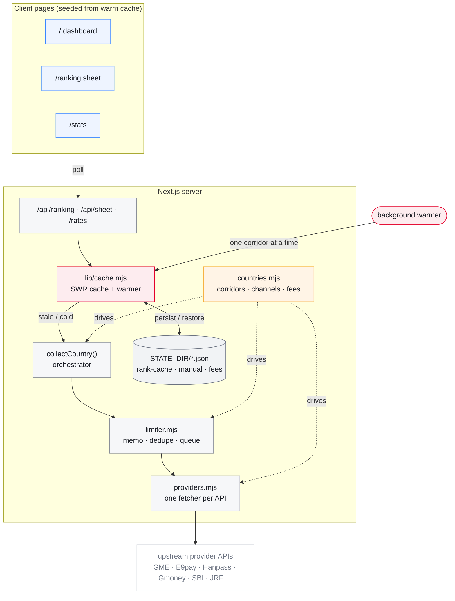
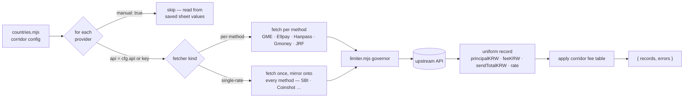
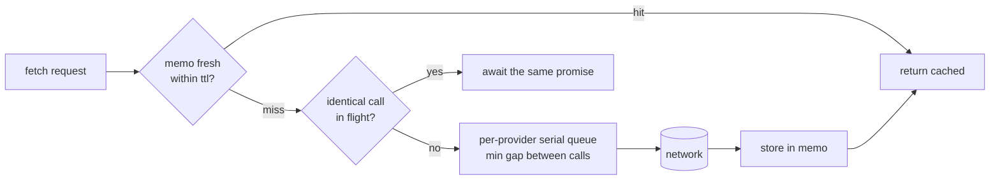
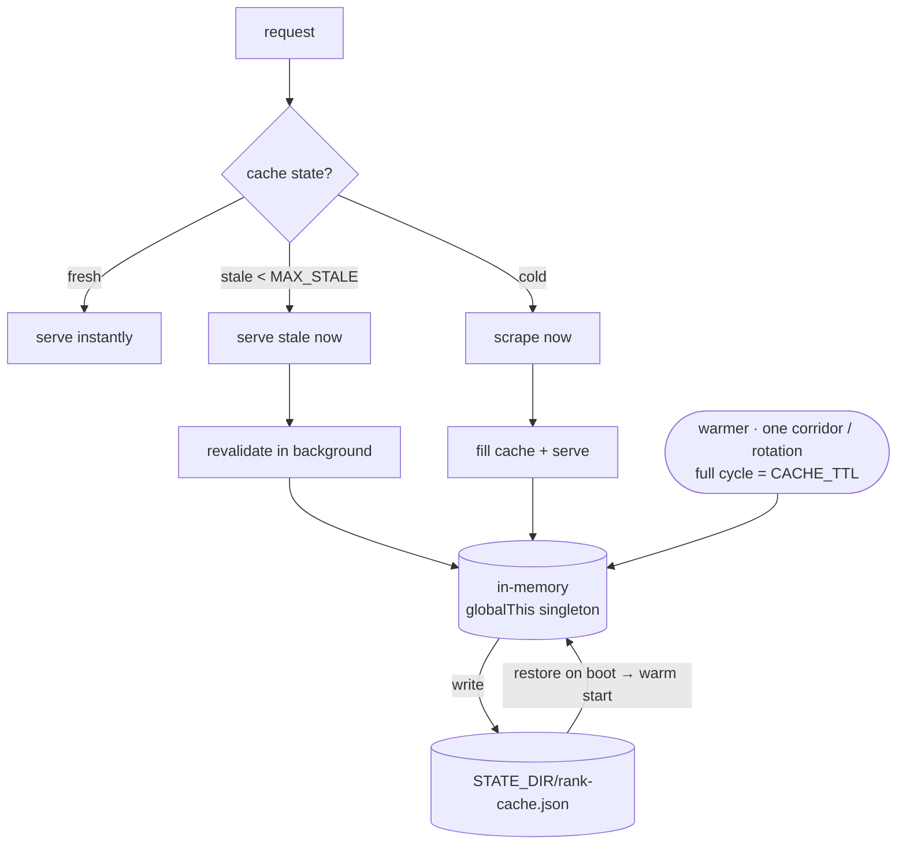
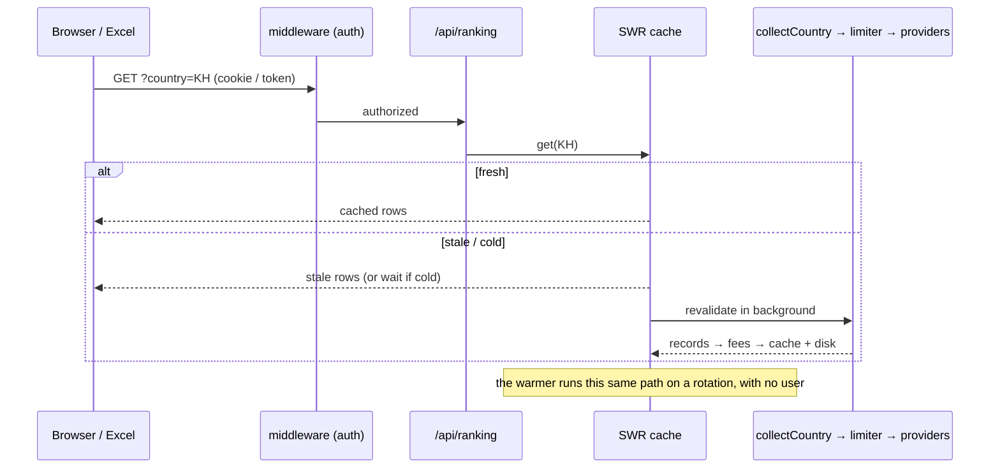

# Remittance Rate Comparison

Korea-outbound money-transfer **rate comparison**. Scrapes ~14 providers across 9
corridors (KH · VN · NP · ID · LK · PH · CN · TH · MM) and serves them as a dashboard,
a spreadsheet "sheet view", a JSON feed for Excel / Power Automate, and usage stats.

**Next.js 15 (App Router) · Tailwind v4 · single persistent Node instance** behind a
Cloudflare tunnel.

---

## Architecture



Four files, four jobs:

| File | Job |
|------|-----|
| `countries.mjs` | **WHAT** — corridors, providers/channels, fee tables, price-gap anchors |
| `providers.mjs` | **HOW** — one config-driven fetcher per upstream API |
| `limiter.mjs` | **HOW OFTEN** — per-provider memo + in-flight dedupe + serial queue |
| `lib/cache.mjs` | **WHEN** — stale-while-revalidate cache + background warmer + persistence |

---

## Scrape flow — `collectCountry(country)`



- Every fetcher returns the **same shape** — `sendTotalKRW = principalKRW + feeKRW`.
- Jobs run **concurrently** (`Promise.allSettled`, each under a per-job timeout); one
  provider failing never drops the others.
- Provider API codes are corridor-specific and **found by probing** (e.g. E9pay VN =
  `VN03`, Gmoney needs `"Viet Nam"` with a space), then recorded in `countries.mjs`.

---

## The governor — `limiter.mjs`

Every call passes three layers so upstreams are never hammered:



Queues are **per-provider**, so a slow one never blocks the others. **GME is the
strictest** (HTTP 200 + `errorCode 429` after ~4 rapid calls) → largest gap + backoff
retries under the 25 s job timeout. The memo key includes the channel key, so two
channels of one API don't collide.

---

## Cache handling — `lib/cache.mjs`

Policy is **stale-while-revalidate**: serve instantly, refresh in the background.



- **Warmer** (`instrumentation.js`) refreshes one corridor at a time → upstream load is
  `corridors × time`, never `users × time`. This is what keeps GME under its burst limit.
- **Disk persistence** → a restart comes up **warm**, not cold-scraping every corridor.
- **Last-known-good carry-forward** → a provider that misses one scrape keeps its value
  from within `MAX_STALE` (default 900 s) and clears its warning — matched on both
  `PROVIDER` and `PROVIDER/METHOD` shapes, so a transient SBI miss never blanks the row or
  the GME price-gap anchor.
- **Manual rates** (`manual.mjs`) — providers with no scrapeable API are typed on the
  sheet: `code → provider → method`, 1-hour TTL, audit log, typo guard.

> ⚠️ **One instance only.** The in-memory cache + warmer mean this app **cannot be
> serverless**. Two servers on `:8787` (host + Docker, or Windows + Pi) each run a warmer
> and fight over GME's limit — run exactly one.

---

## Request lifecycle



---

## Reference

| Route | Purpose |
|-------|---------|
| `/` · `/ranking` · `/stats` | dashboard · sheet view · usage |
| `/api/ranking?country=XX` | corridor JSON the clients poll |
| `/api/sheet?country=XX` | ranking sheet rendered server-side as **PNG** |
| `/api/poster?method=XX` | single-rate marketing poster **PNG** |
| `/api/send-teams?country=XX` | POST — caption + sheet image to a Teams webhook |
| `/rates` | byte-compatible Excel / Power Automate payload (keep stable) |
| `/manual` · `/fees` | POST — save manual rates / fee overrides |
| `/health` · `/login` · `/admin` | status · web login · admin sign-in |

```bash
npm run dev      # next dev -p 8787
npm run build    # next build   (stop any running server first)
npm start        # next start -p 8787   (persistent process required)
npm run scrape   # CLI Cambodia scrape → rates.xlsx   (--json | --payload)
```

**Env:** `RATES_TOKEN` · `ACCESS_PASSWORD` · `ADMIN_USER`/`ADMIN_PASSWORD_HASH`/`ADMIN_TOKEN`
· `CACHE_TTL` (= warmer cycle) · `GME_TTL` · `MAX_STALE` · `STATE_DIR` · `TZ=Asia/Seoul`
· `TEAMS_WEBHOOK_URL` · `WARMER=off`.

---

## Deployment

Runs as one Docker container behind a Cloudflare tunnel on `127.0.0.1:8787`, from a
**residential IP** (some providers, e.g. SBI, block datacenter IPs).

```bash
docker compose up -d --build                       # local / dev host

docker compose -f docker-compose.pi.yml pull       # Raspberry Pi (arm64) — pre-built image
docker compose -f docker-compose.pi.yml up -d
```

**Releases are tag-driven:** push a `vX.Y.Z` git tag → GitHub Actions builds a multi-arch
(amd64 + arm64) image on native runners and publishes `navong/rate-scraper:vX.Y.Z`
(+ `:latest`) to Docker Hub.
