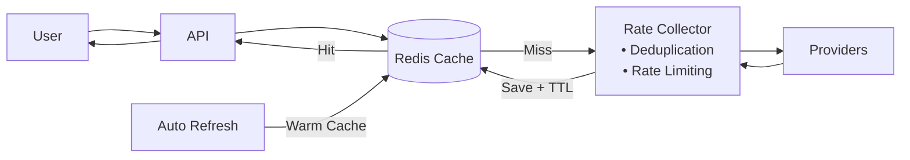
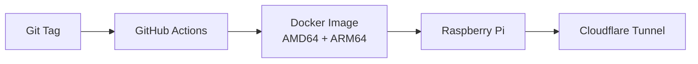

# Remittance Rate Comparison

Compares Korea-outbound remittance providers by total KRW price:

```text
Total price = Exchange amount + Service fee
Price gap   = Provider total - GME total
```

## Architecture



- Cache hits return immediately.
- Cache misses fetch and normalize provider rates.
- Deduplication combines identical requests.
- Per-provider queues prevent rate-limit errors.
- Auto refresh keeps the cache warm.
- Redis shares rates, manual inputs, fees, and usage data.
- Recent last-known-good values are kept when a provider temporarily fails.

## Features

- Dashboard, sheet view, and historical graph
- Multiple countries, providers, and payout methods
- Automatic and manual rates
- Price ranking against GME
- PNG export, Teams sharing, and Excel/Power Automate feed
- Responsive web interface

## Stack

`Next.js` · `React` · `TypeScript` · `Tailwind CSS` · `Redis` · `Docker` ·
`Recharts` · `Sharp`

## Main files

| File | Purpose |
|---|---|
| `lib/countries.ts` | Countries, providers, methods, and fees |
| `lib/providers.ts` | Provider integrations |
| `lib/limiter.ts` | Deduplication, queues, delays, and retries |
| `lib/cache.ts` | Cache and automatic refresh |
| `lib/redis.ts` | Shared storage |
| `lib/ranking.ts` | Total price and ranking |
| `lib/manual.ts` | Manual rates with 30-minute expiry |
| `app/` | Pages and API routes |

## Run

```bash
npm install
npm run dev
```

Open `http://localhost:8787`.

```bash
npm run build
npm start
```

## Deploy



```bash
docker compose up -d --build
./pi-update.sh
```
