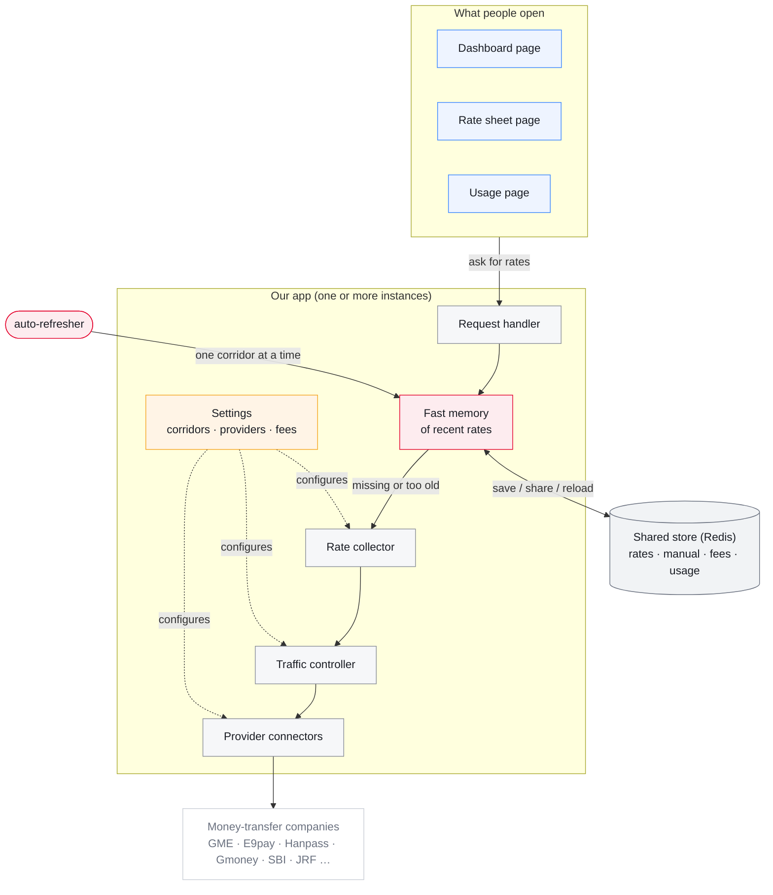
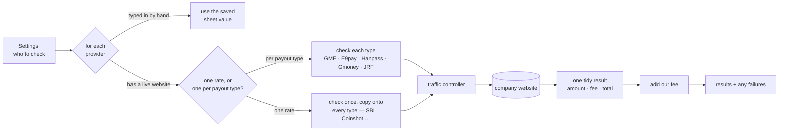
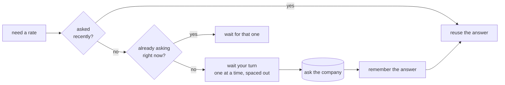
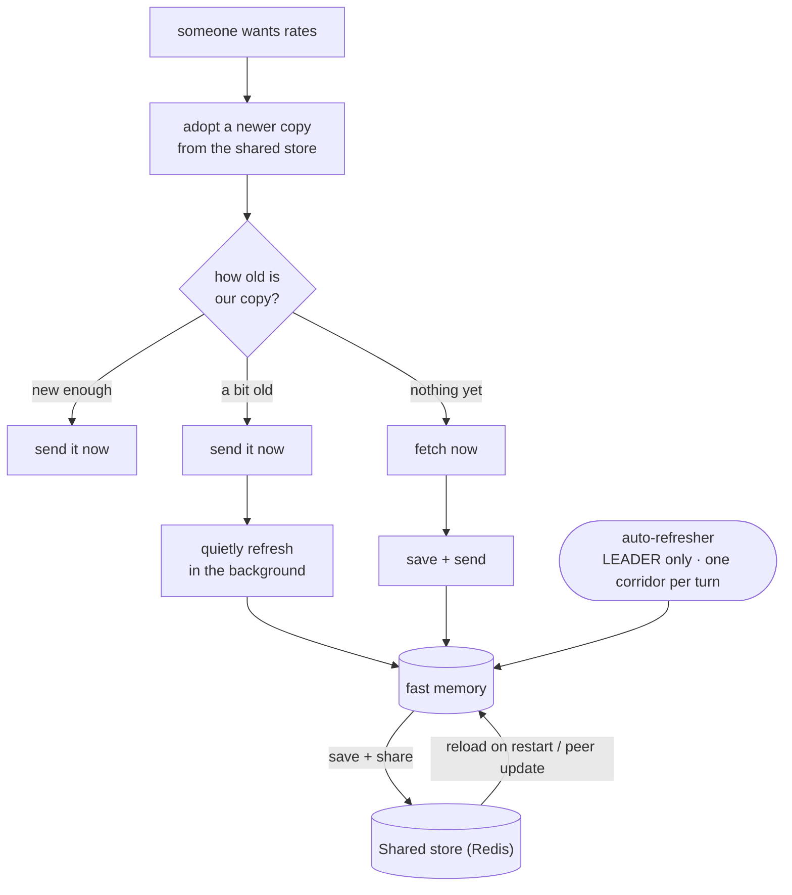
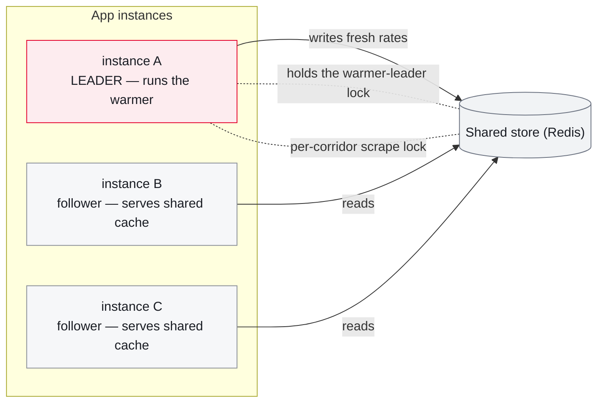
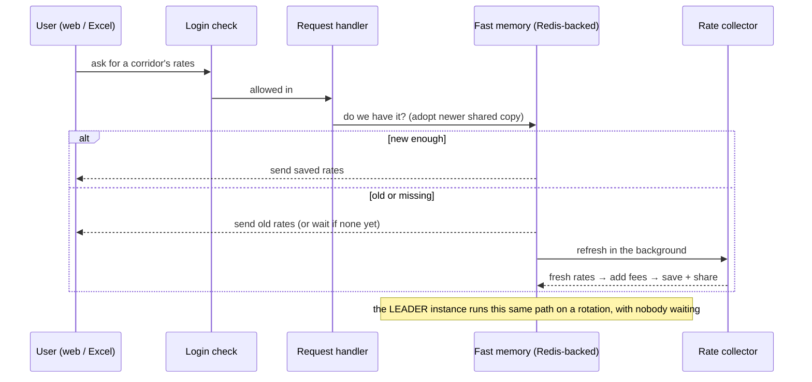

# Remittance Rate Comparison

Korea-outbound money-transfer **rate comparison**. Scrapes ~14 providers across 9
corridors (KH · VN · NP · ID · LK · PH · CN · TH · MM) and serves them as a dashboard,
a spreadsheet "sheet view", a JSON feed for Excel / Power Automate, and usage stats.

**Next.js 15 (App Router) · TypeScript · Tailwind v4 · Redis-backed shared state**
(scales to multiple instances) behind a Cloudflare tunnel.

---

## Architecture



> No Redis configured? The store falls back to **JSON files on disk** and the app
> runs as a single instance — same behavior, minus the sharing.

The core modules:

| File | Job |
|------|-----|
| `lib/countries.ts` | **WHAT** — corridors, providers/channels, fee tables, price-gap anchors |
| `lib/providers.ts` | **HOW** — one config-driven fetcher per upstream API |
| `lib/limiter.ts` | **HOW OFTEN** — per-provider memo + in-flight dedupe + serial queue |
| `lib/cache.ts` | **WHEN** — stale-while-revalidate cache + background warmer + persistence |
| `lib/redis.ts` | **WHERE** — shared store: leader lock, per-corridor lock, pub/sub (optional) |

---

## Scrape flow — `collectCountry(country)`



- Every fetcher returns the **same shape** — `sendTotalKRW = principalKRW + feeKRW`.
- Jobs run **concurrently** (`Promise.allSettled`, each under a per-job timeout); one
  provider failing never drops the others.
- Provider API codes are corridor-specific and **found by probing** (e.g. E9pay VN =
  `VN03`, Gmoney needs `"Viet Nam"` with a space), then recorded in `lib/countries.ts`.

---

## The governor — `lib/limiter.ts`

Every call passes three layers so upstreams are never hammered:



Queues are **per-provider**, so a slow one never blocks the others. **GME is the
strictest** (HTTP 200 + `errorCode 429` after ~4 rapid calls) → largest gap + backoff
retries under the 25 s job timeout. The memo key includes the channel key, so two
channels of one API don't collide.

---

## Cache handling — `lib/cache.ts` + `lib/redis.ts`

Policy is **stale-while-revalidate**: serve instantly, refresh in the background. Fast
memory is the hot path; the shared store (Redis) makes it durable and shared.



- **Warmer** (`instrumentation.ts`) refreshes one corridor at a time → upstream load is
  `corridors × time`, never `users × time`. This is what keeps GME under its burst limit.
- **Shared + durable** → the cache, manual rates, fees and usage all live in Redis, so a
  restart comes up **warm** and every instance sees the same data.
- **Last-known-good carry-forward** → a provider that misses one scrape keeps its value
  from within `MAX_STALE` (default 900 s) and clears its warning — matched on both
  `PROVIDER` and `PROVIDER/METHOD` shapes, so a transient SBI miss never blanks the row or
  the GME price-gap anchor.
- **Manual rates / fees** (`lib/manual.ts`, `lib/fees.ts`) — kept behind their fast
  synchronous getters via an in-memory copy that hydrates from Redis and stays fresh across
  instances via **pub/sub**. Manual rates carry a 1-hour TTL, audit log and typo guard.

### Running several instances

Exactly **one** instance scrapes (it wins a Redis **leader lock**); the rest serve the
shared copy and never double-hit a provider. No Redis → single instance + JSON files.



> ⚠️ Only one process can bind `:8787` on a given host. Multiple instances = multiple
> hosts/ports; the leader lock (not the port) is what keeps GME safe. With **no Redis**,
> run exactly one instance — every process would warm and fight over GME's limit.

---

## Request lifecycle



---

## Reference

| Route | Purpose |
|-------|---------|
| `/` · `/ranking` · `/stats` | dashboard · sheet view · usage |
| `/api/ranking?country=XX` | corridor JSON the clients poll |
| `/api/sheet?country=XX` | ranking sheet rendered server-side as **PNG** |
| `/api/poster?method=XX` | single-rate marketing poster **PNG** |
| `/api/send-teams?country=XX` | POST — caption + sheet image to a Teams webhook |
| `/rates` | byte-compatible Excel / Power Automate payload (keep stable) |
| `/manual` · `/fees` | POST — save manual rates / fee overrides |
| `/health` · `/login` · `/admin` | status · web login · admin sign-in |

```bash
npm run dev      # next dev -p 8787
npm run build    # next build   (stop any running server first)
npm start        # next start -p 8787   (persistent process required)
npm run scrape   # CLI Cambodia scrape → rates.xlsx   (--json | --payload)
```

**Env:** `RATES_TOKEN` · `ACCESS_PASSWORD` · `ADMIN_USER`/`ADMIN_PASSWORD_HASH`/`ADMIN_TOKEN`
· `REDIS_URL` (shared store; unset = JSON files, single instance) · `CACHE_TTL` (= warmer
cycle) · `GME_TTL` · `MAX_STALE` · `STATE_DIR` · `TZ=Asia/Seoul` · `TEAMS_WEBHOOK_URL` · `WARMER=off`.

---

## Deployment

Runs via Docker Compose (backend + a `redis` service) behind a Cloudflare tunnel on
`127.0.0.1:8787`, from a **residential IP** (some providers, e.g. SBI, block datacenter IPs).

```bash
docker compose up -d --build     # local / dev host — builds from source (+ redis)

# Raspberry Pi (arm64) — pulls the pre-built image, no build. One command:
./pi-update.sh                   # redeploy the pinned version
./pi-update.sh v1.1.0            # switch to v1.1.0, then redeploy
```

**First Redis deploy — carry analytics history over once** (manual rates + fees migrate
automatically; the usage log does not):

```bash
docker compose exec backend npx tsx scripts/import-events.ts
```

**Releases are tag-driven:** push a `vX.Y.Z` git tag → GitHub Actions builds a multi-arch
(amd64 + arm64) image on native runners and publishes `navong/rate-scraper:vX.Y.Z`
(+ `:latest`) to Docker Hub.
