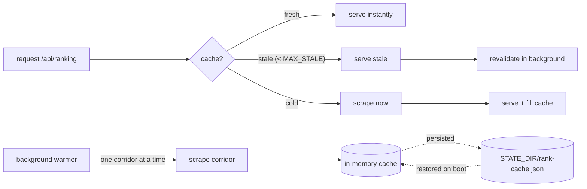
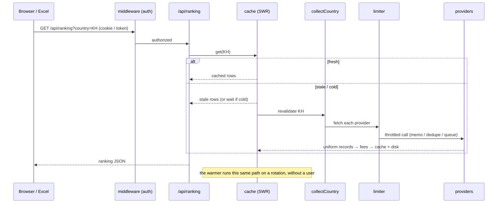

# Remittance Rate Comparison

A Korea-outbound **money-transfer rate comparison** service. It scrapes ~14 remittance
providers across corridors (Cambodia, Vietnam, Nepal, Indonesia, Sri Lanka, Philippines,
China, Thailand, Myanmar) and presents them as a web dashboard, a spreadsheet-style
"sheet view", a JSON feed for Excel / Power Automate, and usage analytics.

Built with **Next.js 15 (App Router) + Tailwind v4**, running as a **single persistent
Node instance** behind a Cloudflare tunnel.

---

## Why "single persistent instance"

This app is deliberately **not serverless**. It keeps an in-memory cache and runs a
background warmer that refreshes rates on a rotation. Upstream load is therefore
`corridors × time`, never `users × time` — which is what keeps the strict providers
(notably GME) under their burst limits. Two instances = duplicate scraping + rate-limit
trouble, so exactly one process must own the scraping.

---

## Scrape architecture

Four pieces, each in one file, compose the whole scrape path:

```
countries.mjs   → WHAT to fetch   (corridors, providers, channels, fees, anchors)
providers.mjs   → HOW to fetch    (one config-driven fetcher per upstream API)
limiter.mjs     → HOW OFTEN       (per-provider memo + dedupe + serial queue)
lib/cache.mjs   → WHEN to serve   (stale-while-revalidate + warmer + persistence)
```

### 1. Config is the source of truth — `countries.mjs`

A corridor declares its `currency`, `receiveAmount` (the fixed amount the customer
receives), the payout `methods`, an `anchor` (the GME baseline used for the price-gap
column), and its `providers`. The scrapers, the tables, the anchor math, and the manual
editor are all driven off this one object.

```js
KH: {
  code: "KH", name: "Cambodia", currency: "USD", receiveAmount: 1000,
  anchor: "GME",
  methods: [{ key: "BANK", label: "Bank Deposit" }, { key: "WALLET", label: "Cash Payment" }],
  providers: {
    GME:     { countryName: "Cambodia", deliveryMethod: { BANK: "2", WALLET: "13" }, fee: { … } },
    E9PAY:   { nation: { BANK: "KH09", WALLET: "KH04" }, fee: { … } },
    HANPASS: { countryCode: "KH", option: { BANK: "BANK_TRANSFER", … }, fee: { … } },
    GMONEY:  { country: "Cambodia", payment: { BANK: "Bank Account", … }, fee: { … } },
    SBI:     { countryId: "CAMBODIA", fee: { … } },
    SENTBE:  { manual: true, fee: { … } },   // no scrapeable API → typed in on the sheet
  },
},
```

Provider API codes are **corridor-specific and usually undiscoverable by guessing**
(e.g. E9pay's Vietnam bank code is `VN03`; Gmoney needs the country spelled `"Viet Nam"`
with a space). They are found by probing the live API and matching returned KRW to known
values, then recorded here with a comment.

The pure helpers `amountFor` / `anchorOf` / `providerInMethod` also live here and have
**no Node imports**, so client components can import them too.

### 2. Providers and "channels" — `providers.mjs`

Each fetcher (`fetchGme`, `fetchE9pay`, `fetchHanpass`, `fetchGmoney`, `fetchSbi`,
`fetchJrf`, …) is config-driven and takes the provider **key**, so one upstream API can
back several rows. A provider entry can be a plain provider, or a **channel** — a key
like `GME_WU` / `HANPASS_CB` with its own `label`, a `methods: [...]` scope, a per-method
fee, and either `manual: true` **or** `api: "HANPASS"` to pick the scraper.

Every fetcher resolves to one uniform record:

```
{ provider, method, principalKRW, feeKRW, sendTotalKRW, rate }
      where  sendTotalKRW = principalKRW + feeKRW
```

Fetchers split into two kinds:

- **Per-method** (`GME`, `E9PAY`, `HANPASS`, `GMONEY`, `JRF`) — quote a rate per payout
  method; called once per method.
- **Single-rate** (`SBI`, `COINSHOT`, `UTRANSFER`, `PANDA`) — one rate for the whole
  corridor; fetched once and **mirrored** onto every method so they appear in each table.

### 3. The governor — `limiter.mjs`

Every provider call goes through a per-provider governor with three layers:

1. **memo** — an identical call reuses the last response for `ttl` seconds.
2. **in-flight dedupe** — concurrent identical calls collapse into ONE network call.
3. **serial queue** — that provider's calls are serialized with a **minimum gap**.

Queues are per-provider, so a slow/limited provider never stalls the others. **GME is the
strictest** (it returns HTTP 200 + `errorCode 429` after ~4 rapid calls), so it gets a
large gap and `gmeFetch` retries transient failures with backoff, all under the 25 s job
timeout. The memo key includes the channel key, so two channels of the same API don't
collide.

### 4. The orchestrator — `collectCountry(country)`

```
for each provider in the corridor
    skip manual providers (they come from the saved sheet values)
    resolve  api = cfg.api || key
    single-rate api → fetch once
    per-method  api → fetch once per method it participates in
run all jobs concurrently  (Promise.allSettled, each under a per-job timeout)
mirror single-rate results onto every method
apply the corridor's fee table
→ { records, errors }
```

Failures are isolated per job: one provider erroring never drops the others.

---

## Cache handling — `lib/cache.mjs`

The cache is what turns "scrape everything on every request" into "scrape a little, all
the time." Policy is **stale-while-revalidate (SWR)**.



**In-memory singletons pinned to `globalThis`.** They survive dev hot-reload, and there is
exactly one set per process.

**Background warmer.** Started once via `instrumentation.js`, it refreshes **one corridor
at a time** on a rotation whose full cycle is `CACHE_TTL`. This is the main lever that
keeps upstream load flat and GME under its burst limit — users read the cache, the warmer
does the scraping.

**Disk persistence.** The corridor cache is written to `STATE_DIR/rank-cache.json` and
restored on boot, so a restart comes up **warm** instead of cold-scraping every corridor.

**Last-known-good carry-forward.** If a provider fails a scrape but a value from within the
last `MAX_STALE` (default 900 s) exists, that value is carried forward and its
"unavailable this run" warning is cleared. This is matched against **both** error shapes —
a bare `PROVIDER` and a `PROVIDER/METHOD` — so e.g. a transient SBI miss doesn't blank the
row or the GME price-gap anchor.

**Manual rates.** Providers with no scrapeable API (`manual: true`) are typed in on the
sheet, stored per `code → provider → method` with a 1-hour TTL (expired → shown as `-` and
excluded from the gap math), an audit log, and a typo guard. Managed in `manual.mjs`,
persisted under `STATE_DIR`.

---

## A request's life (end to end)



---

## Routes

| Route | Purpose |
|-------|---------|
| `/` · `/ranking` · `/stats` | dashboard · sheet view · usage (client pages seeded from the warm cache) |
| `/api/ranking?country=XX` | corridor JSON the clients poll |
| `/api/sheet?country=XX` | the ranking sheet rendered server-side as a **PNG** |
| `/api/poster?method=XX` | a single-rate marketing poster **PNG** (Cambodia) |
| `/api/send-teams?country=XX` | POST — post the caption + sheet image to a Teams webhook |
| `/rates` | byte-compatible Cambodia payload for Excel / Power Automate (keep stable) |
| `/manual` · `/fees` | POST — save manual rates / fee overrides |
| `/health` | cache + limiter status · `/login` · `/admin` |

Auth is in `middleware.js`: a short `ACCESS_PASSWORD` (web login) or the long
`RATES_TOKEN` (machines, via `?token=` / `x-api-token`); a role-based **admin** gates the
pipeline pages.

---

## Development

```bash
npm run dev        # next dev -p 8787
npm run build      # next build  (STOP any running server first)
npm start          # next start -p 8787  (a persistent process is required)
npm run scrape     # node scrape.mjs — CLI Cambodia scrape → rates.xlsx
npm run json       # scrape.mjs --json      (raw JSON)
npm run payload    # scrape.mjs --payload   (the /rates payload shape)
```

There is no test suite; verify changes by running the server and hitting the endpoints,
or with an ad-hoc probe script that imports `providers.mjs` against a live API.

**Key env vars:** `RATES_TOKEN`, `ACCESS_PASSWORD`, `ADMIN_USER` / `ADMIN_PASSWORD_HASH`
/ `ADMIN_TOKEN`, `CACHE_TTL` (also the warmer's cycle), `GME_TTL`, `MAX_STALE`,
`STATE_DIR` (persistent data dir), `TZ=Asia/Seoul`, `TEAMS_WEBHOOK_URL`, `WARMER=off`.

---

## Deployment

Runs as one Docker container behind a shared Cloudflare tunnel on `127.0.0.1:8787` —
from a **residential IP** (some providers, e.g. SBI, block datacenter IPs).

```bash
docker compose up -d --build          # local / dev host
```

**Raspberry Pi (arm64)** — run the pre-built image, no local build:

```bash
docker compose -f docker-compose.pi.yml pull
docker compose -f docker-compose.pi.yml up -d
```

**Releases** are tag-driven: pushing a `vX.Y.Z` git tag triggers GitHub Actions to build a
multi-arch (amd64 + arm64) image on native runners and publish
`navong/rate-scraper:vX.Y.Z` (+ `:latest`) to Docker Hub.

> ⚠️ **One instance only.** Never run two servers on 8787 (host + Docker, or Windows +
> Pi) — each starts its own warmer and they fight over GME's burst limit.
