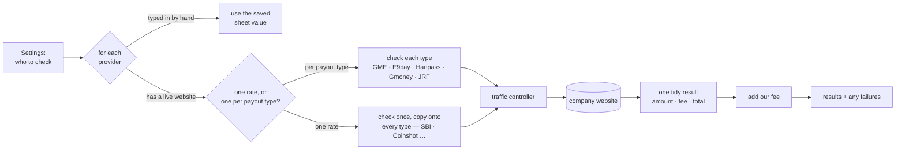
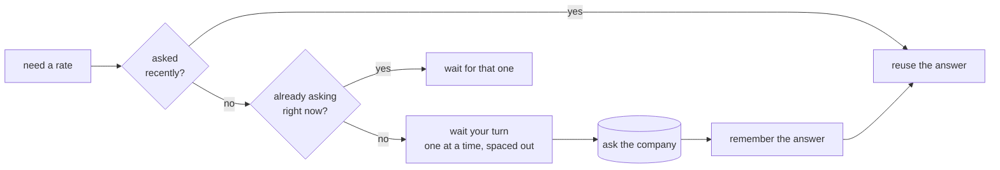
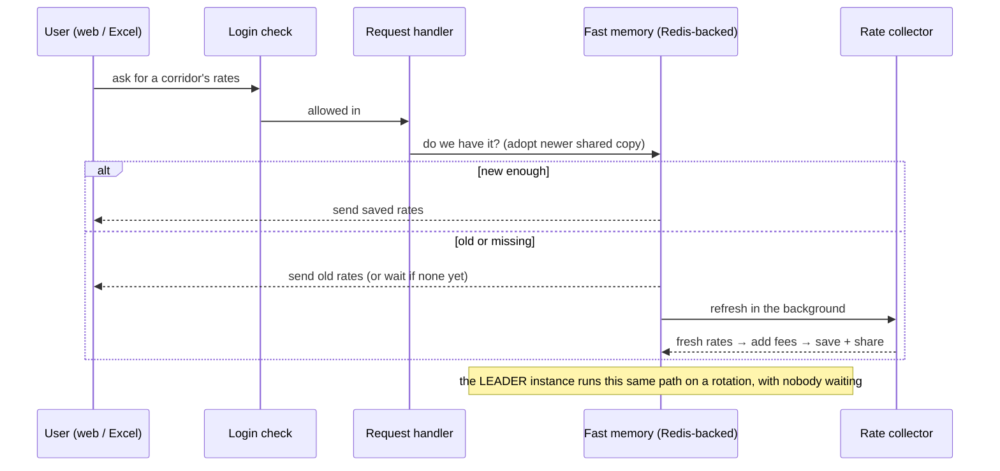

# Remittance Rate Comparison

Korea-outbound money-transfer **rate comparison**. Scrapes ~14 providers across 10
corridors (KH · VN · NP · ID · LK · BD · PH · CN · TH · MM) and serves them as a dashboard,
a spreadsheet "sheet view", a JSON feed for Excel / Power Automate, and usage stats.

**Next.js 15 (App Router) · TypeScript · Tailwind v4 · Redis-backed shared state**
(scales to multiple instances) behind a Cloudflare tunnel.

---

## Architecture


> No Redis configured? The store falls back to **JSON files on disk** and the app
> runs as a single instance — same behavior, minus the sharing.

The core files:

| File | Job |
|------|-----|
| `lib/countries.ts` | **WHAT** — which providers to check per corridor, and their fees |
| `lib/providers.ts` | **HOW** — one small fetcher per company |
| `lib/limiter.ts` | **HOW OFTEN** — spaces out calls so no company is hammered |
| `lib/cache.ts` | **WHEN** — serves rates instantly, refreshes in the background |
| `lib/redis.ts` | **WHERE** — the shared store that keeps every copy in sync (optional) |

---

## How rates get fetched



- The number that matters is the same everywhere: **KRW to send = amount + fee**.
- All companies are checked **at the same time**, so one slow or broken company never
  holds up the rest.
- Each company uses its own codes per corridor (found by testing their live site) — kept
  in the settings file so nothing is guessed at runtime.

---

## Not hammering the providers

Every call passes three checks so no company gets too many requests:



Each company has its **own queue** with a small gap between calls, so a slow one never
blocks the others. **GME is the strictest** — it blocks you after a few rapid calls, so it
gets the biggest gap plus automatic retries.

---

## Keeping rates fresh (and shared)

Rates are served **instantly from memory** and refreshed **in the background**, so pages
never wait on a live fetch. The shared store (Redis) makes that data durable and shared.


- **Auto-refresher** — refreshes one corridor at a time on a timer, so the companies see
  steady, light traffic instead of a spike every time someone visits. This is what keeps
  GME from blocking us.
- **Shared + durable** — the cache, manual rates, fees and usage all live in the shared
  store, so a restart comes back with data already loaded and every copy sees the same thing.
- **Never blanks on a blip** — if a company misses one refresh, we keep its last recent
  value instead of showing a gap.
- **Typed-in rates & fees** — providers with no live rate are typed on the sheet; those and
  any fee tweaks are saved in the shared store. Manual rates expire after **1 hour**, so an
  old number can't quietly pass as current.

---

## Request lifecycle



---

## Reference

| Route | Purpose |
|-------|---------|
| `/` · `/ranking` · `/stats` | dashboard · sheet view · usage |
| `/api/ranking?country=XX` | corridor JSON the clients poll |
| `/api/sheet?country=XX` | ranking sheet rendered server-side as **PNG** |
| `/api/poster?method=XX` | single-rate marketing poster **PNG** |
| `/api/send-teams?country=XX` | POST — caption + sheet image to a Teams webhook |
| `/rates` | the exact JSON shape Excel / Power Automate expects (keep it stable) |
| `/manual` · `/fees` | POST — save manual rates / fee overrides |
| `/health` · `/login` · `/admin` | status · web login · admin sign-in |

```bash
npm run dev      # next dev -p 8787
npm run build    # next build   (stop any running server first)
npm start        # next start -p 8787   (persistent process required)
npm run scrape   # CLI Cambodia scrape → rates.xlsx   (--json | --payload)
```

**Env:** `RATES_TOKEN` · `ACCESS_PASSWORD` · `ADMIN_USER`/`ADMIN_PASSWORD_HASH`/`ADMIN_TOKEN`
· `REDIS_URL` (shared store; unset = JSON files, single instance) · `CACHE_TTL` (= warmer
cycle) · `GME_TTL` · `MAX_STALE` · `STATE_DIR` · `TZ=Asia/Seoul` · `TEAMS_WEBHOOK_URL` · `WARMER=off`.

---

## Deployment

Runs via Docker Compose (backend + a `redis` service) behind a Cloudflare tunnel on
`127.0.0.1:8787`, from a **residential IP** (some providers, e.g. SBI, block datacenter IPs).

> Run **one copy** unless Redis is set up — two copies without the shared store would both
> fetch from the companies and get you blocked.

```bash
docker compose up -d --build     # local / dev host — builds from source (+ redis)

# Raspberry Pi (arm64) — pulls the pre-built image, no build. One command:
./pi-update.sh                   # redeploy the pinned version
./pi-update.sh v1.1.0            # switch to v1.1.0, then redeploy
```

**First Redis deploy — carry analytics history over once** (manual rates + fees migrate
automatically; the usage log does not):

```bash
docker compose exec backend npx tsx scripts/import-events.ts
```

**Releases are tag-driven:** push a `vX.Y.Z` git tag → GitHub Actions builds a multi-arch
(amd64 + arm64) image on native runners and publishes `navong/rate-scraper:vX.Y.Z`
(+ `:latest`) to Docker Hub.
